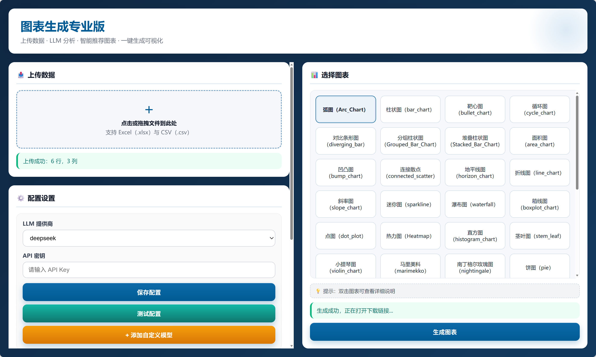
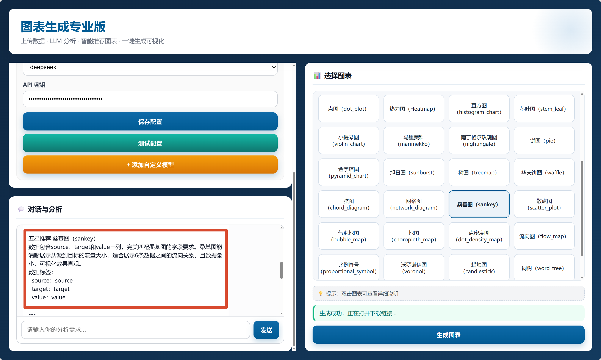
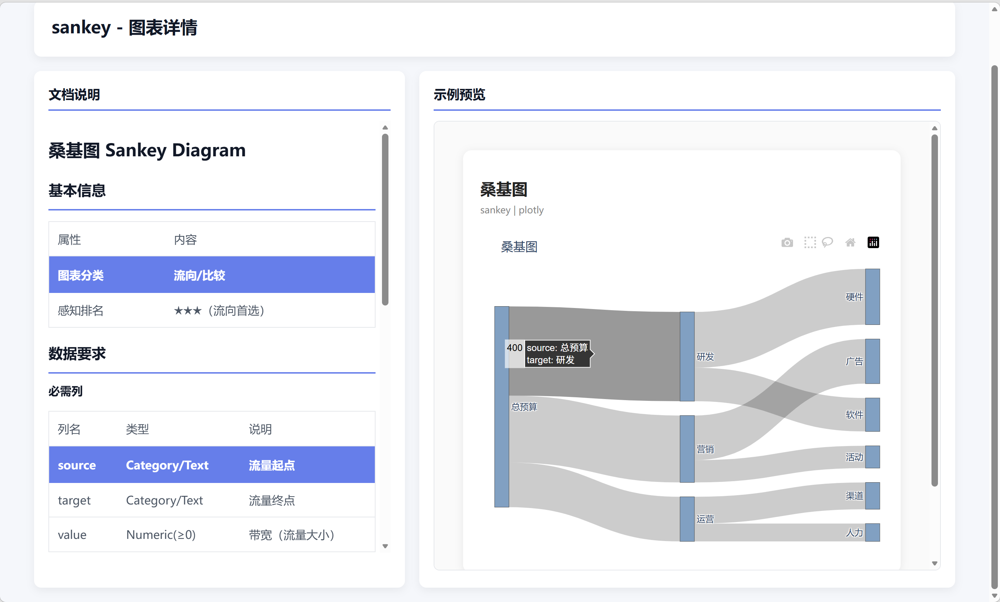
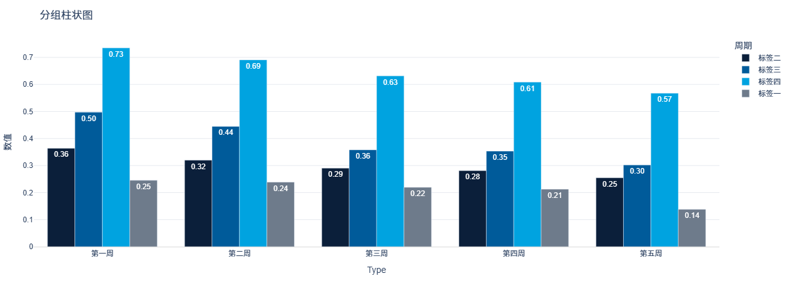

# VizPilot AI / 智能图表推荐与生成系统

[](#)
[](#)
[](#)
[](#)
[](#)
[](#)

> **中文**：上传数据，智能推荐图表，一键生成交互式可视化。  
> **English**: Upload data, get chart recommendations, and generate interactive visualizations in one click.

---

## 目录 / Table of Contents

- [项目简介 / Overview](#项目简介--overview)
- [功能特性 / Features](#功能特性--features)
- [在线预览截图 / Screenshots](#在线预览截图--screenshots)
- [快速开始 / Quick Start](#快速开始--quick-start)
- [项目结构 / Project Structure](#项目结构--project-structure)
- [图表系统（Registry 驱动）/ Registry-driven Chart System](#图表系统registry-驱动-registry-driven-chart-system)
- [LLM 配置 / LLM Configuration](#llm-配置--llm-configuration)
- [支持的图表类型 / Supported Chart Types](#支持的图表类型--supported-chart-types)
- [使用流程 / Usage Flow](#使用流程--usage-flow)
- [开发指南 / Development Guide](#开发指南--development-guide)
- [常见问题 / FAQ](#常见问题--faq)
- [路线图 / Roadmap](#路线图--roadmap)
- [贡献指南 / Contributing](#贡献指南--contributing)
- [许可证 / License](#许可证--license)

---

## 项目简介 / Overview

**VizPilot AI** 是一个基于 LLM 的智能图表推荐与生成系统。  
上传 Excel/CSV 数据后，系统会自动分析字段类型与数据特征，推荐最适合的图表，并生成可交互 HTML 结果。

**VizPilot AI** is an LLM-powered chart recommendation and generation system.  
After uploading Excel/CSV files, it automatically analyzes data structure, recommends suitable chart types, and generates interactive HTML charts.

### 核心价值 / Why this project

- **降低图表选择门槛**：不会选图也能快速出图
- **提升可视化效率**：从数据到图表只需几步
- **可扩展架构**：图表注册中心统一管理，前后端自动同步

---

## 功能特性 / Features

### 1) 数据上传与分析 / Data Upload & Profiling
- 支持 `CSV`、`Excel (.xlsx)`
- 自动识别字段类型：数值 / 类别 / 日期
- 展示数据规模（行数、列数）

### 2) LLM 智能推荐 / LLM-based Recommendation
- 支持多提供商：DeepSeek、MiniMax、OpenAI 兼容接口
- 推荐 3-5 个候选图表
- 提供推荐理由、星级评分、字段映射建议（X/Y/Color/Size）

### 3) 图表选择与详情 / Chart Selection & Details
- 图表网格单击选择
- 双击查看图表详情页（README + 示例）
- 支持 Markdown 渲染（表格、代码块、列表）

### 4) 图表生成与导出 / Chart Generation & Export
- 自动字段映射
- 调用对应图表模块生成 Plotly 图表
- 输出交互式 HTML 并支持下载

### 5) 注册中心架构 / Registry Architecture
- 所有图表元数据统一在 `charts/registry.py`
- 新增/删除图表只需改 registry
- 前后端列表自动同步，无需重复修改逻辑

---

## 在线预览截图 / Screenshots

### 首页 / Home


### LLM 推荐结果 / LLM Recommendations


### 图表详情页 / Chart Detail


### 生成结果 / Generated Chart


---

## 快速开始 / Quick Start

### 环境要求 / Requirements
- Python 3.7+
- pip

### 1) 安装依赖 / Install dependencies
```bash
pip install -r requirements.txt
```

### 2) 启动应用 / Run the app
```bash
python app_pro.py
```

或 Windows 下双击：
```bash
start.bat
```

### 3) 访问地址 / Open in browser
`http://localhost:5017`

---

## 项目结构 / Project Structure

```text
Chart_generate/
├── app_pro.py                 # Flask 后端应用（API + 页面路由）
├── chart_generate.py          # 图表生成核心（调用 charts 模块）
├── LLM/
│   ├── llm_recommender.py     # LLM 推荐引擎
│   └── llm_config_manager.py  # LLM 配置管理
├── templates/
│   ├── index.html             # 主页面
│   └── chart-detail.html      # 图表详情页面
├── charts/
│   ├── registry.py            # 图表元数据注册表（核心）
│   ├── base.py                # 图表统一接口
│   ├── bar_chart/
│   │   ├── chart.py
│   │   ├── README.md
│   │   └── result.html
│   ├── line_chart/
│   ├── scatter_plot/
│   └── ...                    # 其他图表实现
├── uploads/                   # 上传文件（临时）
├── outputs/                   # 生成结果（下载）
└── README.md
```

---

## 图表系统（Registry 驱动）/ Registry-driven Chart System

### 设计理念 / Design
- 图表实现与图表元数据解耦
- 通过 `registry.py` 单点维护图表目录
- 新增图表无需修改主流程代码

### 新增图表 / Add a new chart
1. 在 `charts/<new_chart>/` 新建实现：
   - `chart.py`
   - `README.md`
   - `result.html`（可选）
2. 在 `charts/registry.py` 注册元信息
3. 重启服务后自动出现在前端列表

---

## LLM 配置 / LLM Configuration

### 支持的提供商 / Supported Providers
1. **DeepSeek**
   - API: `https://api.deepseek.com`
   - Model: `deepseek-chat`
   - Env: `DEEPSEEK_API_KEY`

2. **MiniMax**
   - API: `https://api.minimax.chat/v1`
   - Model: `MiniMax-M2.7`
   - Env: `MINIMAX_API_KEY`

3. **OpenAI-compatible**
   - 自定义 `base_url`、`model`、`api_key`
   - Customizable `base_url`, `model`, and `api_key`

### 配置方式 / How to configure

#### 方式 A：环境变量 / Option A: Environment variables
**Windows**
```bash
set DEEPSEEK_API_KEY=your_api_key
set MINIMAX_API_KEY=your_api_key
```

**macOS/Linux**
```bash
export DEEPSEEK_API_KEY=your_api_key
export MINIMAX_API_KEY=your_api_key
```

#### 方式 B：前端 Settings 面板 / Option B: Settings panel in UI
在页面 Settings 区域输入并保存 API Key。  
Enter and save API keys in the Settings panel.

---

## 支持的图表类型 / Supported Chart Types

> 当前支持 **45+** 图表（以 `charts/registry.py` 为准）。  
> Currently supports **45+** chart types (source of truth: `charts/registry.py`).

### 比较类 / Comparison
- `arc_chart` - 弧图
- `bar_chart` - 柱状图
- `bullet_chart` - 靶心图
- `cycle_chart` - 循环图
- `diverging_bar` - 对比条形图
- `grouped_bar` - 分组柱状图
- `stacked_bar` - 堆叠柱状图

### 趋势类 / Trend
- `area_chart` - 面积图
- `bump_chart` - 凹凸图
- `connected_scatter` - 连接散点
- `horizon_chart` - 地平线图
- `line_chart` - 折线图
- `slope_chart` - 斜率图
- `sparkline` - 迷你图
- `waterfall` - 瀑布图

### 分布类 / Distribution
- `boxplot_chart` - 箱线图
- `dot_plot` - 点图
- `heatmap` - 热力图
- `histogram_chart` - 直方图
- `stem_leaf` - 茎叶图
- `violin_chart` - 小提琴图

### 占比类 / Composition
- `marimekko` - 马里美科
- `nightingale` - 南丁格尔玫瑰图
- `pie` - 饼图
- `pyramid_chart` - 金字塔图
- `sunburst` - 旭日图
- `treemap` - 树图
- `waffle` - 华夫饼图

### 关系类 / Relationship
- `chord_diagram` - 弦图
- `network_diagram` - 网络图
- `sankey` - 桑基图
- `scatter_plot` - 散点图

### 地理类 / Geo
- `bubble_map` - 气泡地图
- `choropleth_map` - 分级设色地图
- `dot_density_map` - 点密度图
- `flow_map` - 流向图
- `proportional_symbol` - 比例符号图
- `voronoi` - 沃罗诺伊图

### 金融类 / Finance
- `candlestick` - 蜡烛图

### 文本类 / Text
- `word_tree` - 词树
- `wordcloud` - 词云

### 多维类 / Multivariate
- `parcoords` - 平行坐标

---

## 使用流程 / Usage Flow

1. 上传 CSV/XLSX 文件  
2. 选择 LLM 提供商并配置 API Key  
3. 输入分析需求（可选）并获取推荐  
4. 在图表网格中选择图表  
5. 点击生成并下载 HTML 图表

---

## 开发指南 / Development Guide

### 本地开发 / Local development
```bash
# install deps
pip install -r requirements.txt

# run
python app_pro.py
```

### 代码规范建议 / Suggested conventions
- 图表模块遵循统一接口（见 `charts/base.py`）
- 图表目录命名使用 snake_case
- 每个图表建议包含：
  - `chart.py`（实现）
  - `README.md`（说明）
  - `result.html`（示例）

---

## 常见问题 / FAQ

### Q1: 为什么推荐结果为空？
- 检查 API Key 是否配置正确
- 检查网络与 LLM 服务状态
- 确认上传文件非空且字段可解析

### Q2: 为什么图表生成失败？
- 检查字段类型是否与图表要求匹配
- 查看后端日志中的异常信息
- 确认对应图表模块实现完整

### Q3: 图表数量为什么和文档不一致？
- 以 `charts/registry.py` 为唯一准源（single source of truth）

---

## 路线图 / Roadmap

- [ ] 自动图表参数调优（主题、配色、标签布局）
- [ ] 多图仪表板拼接与导出
- [ ] SQL 数据源接入
- [ ] 更细粒度字段映射交互
- [ ] 单元测试与回归测试集

---

## 贡献指南 / Contributing

欢迎提交 Issue 和 PR！

1. Fork 仓库
2. 新建分支：`feat/your-feature`
3. 提交代码并发起 Pull Request

建议在 PR 中说明：
- 变更内容
- 影响范围
- 截图或测试结果

---

## 许可证 / License

本项目建议使用 **GPL License**。  
This project is recommended to use the **GPL License**.
